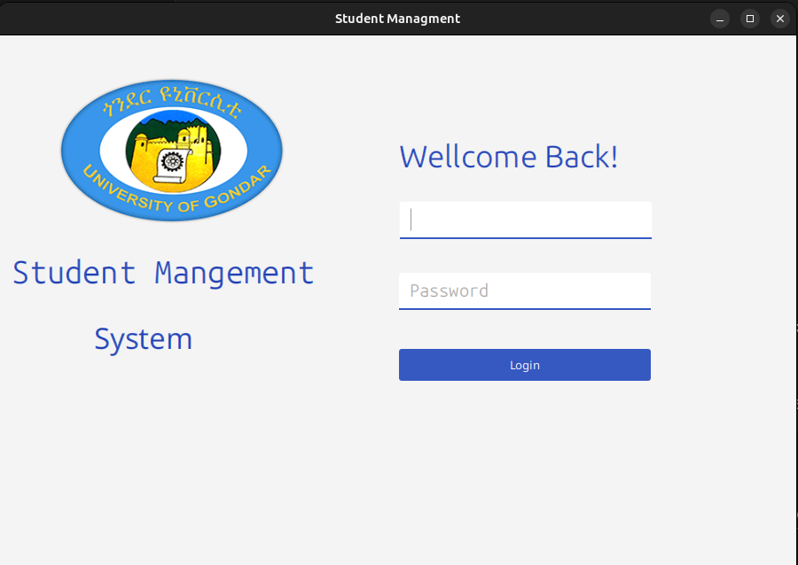
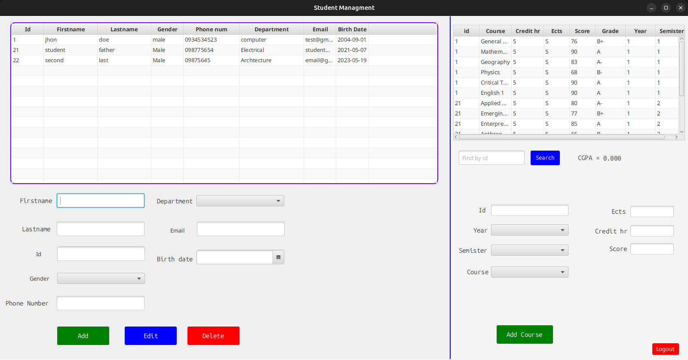

# Student Management System

#### Login

#### Main Dashboard


This Java application is a student management system that allows users to manage student information, including adding, updating, deleting, and searching student records. It also supports managing course records, recording scores for courses, and calculating the CGPA (Cumulative Grade Point Average) of students.

## Features

- **Add Student Records**: Users can add new student records including details such as name, student ID, grade, date of birth, gender, phone number, and email.

- **Add Course Records**: Users can add course records for each semester within a specified year.

- **Record Course Scores**: The system allows recording scores for each course out of 100.

- **Calculate CGPA**: Users can view the CGPA of a specific student based on their recorded scores.

## Technologies Used

- **Java**: Core programming language used for development.

- **JavaFX**: GUI framework for building the graphical interface.

- **SceneBuilder**: Drag-and-drop GUI design tool used to create FXML files for JavaFX applications.

- **MySQL Database**: Used to store and retrieve student and course-related data.

## Setup Instructions

### Prerequisites

1. **Java Development Kit (JDK)**: Ensure you have JDK installed on your system.

2. **MySQL Database**: Install and set up MySQL server.

3. **MySQL Driver**: JDBC.

4. **JavaFx JDK**

### Running the Application

1. **Clone the Repository**:

   ```bash
   git clone https://github.com/kirubel-web/Student_Managment.git
   cd Student_Managment
   ```

2. **Import Project**:

   Open the project in your preferred IDE (e.g., IntelliJ IDEA, Eclipse, Vscode).

3. **Set Up MySQL Database**:

   - Create a new database named `StudentManagment`.
   - Import the SQL schema (`StudentManagment.sql`) located in the repository to create necessary tables.

4. **Configure Database Connection**:

   Update the database connection details (URL, username, password) in the `StudentDB.java` file.

5. **Run the Application**:

   Run the `App.java` file to launch the application.

## Project Structure

- `src/`: Contains Java source files.
  - `controllers/`: JavaFX controllers for handling UI events.
  - `models/`: POJOs (Plain Old Java Objects) representing entities like Student, Course, etc.
  - `utils/`: Utility classes for database connection and other helper functionalities.
- `resources/`: Contains FXML files for UI layout created using SceneBuilder.
- `StudentDB.sql`: SQL file for creating the required database schema.

## Screenshots

_Insert screenshots of the application UI here._

## Contributors

- **Henok Negatu** - [GitHub Profile](https://github.com/HenokNegatu)
- **Kirubel A** - [GitHub Profile](https://github.com/kirubel-web)

## License

This project is licensed under the MIT License - see the [LICENSE](LICENSE) file for details.

